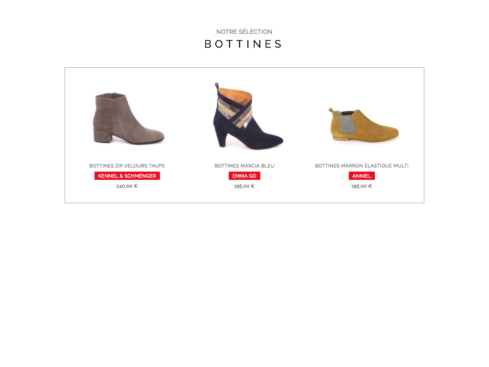
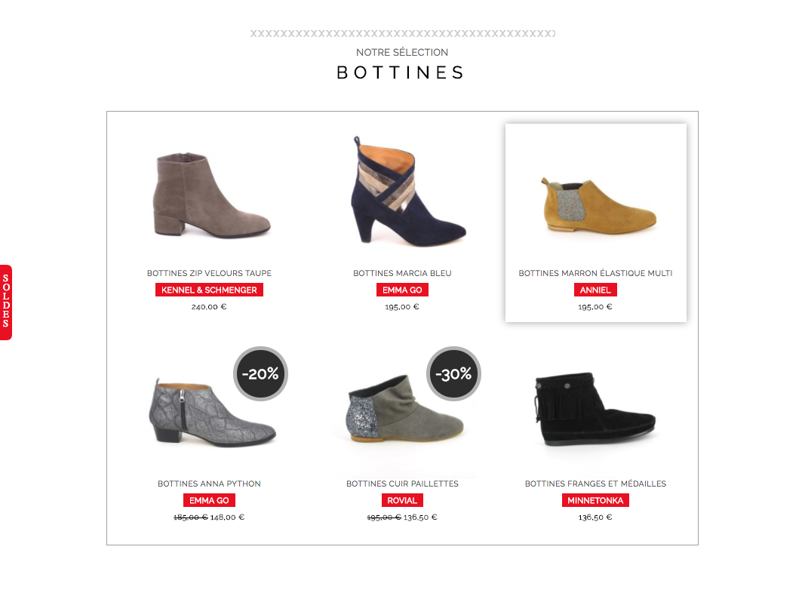

# Projet Boutique

## Objectif

La page "sélection" d'une boutique de chaussures est déjà mise en place.  
Cependant, les soldes n'ont pas du tout été prévus, et il faut rapidement faire l'intégration correspondante.  
Bien entendu, le WebDesigner en a profité pour ajouter quelques _fioritures_ :wink:

## Design actuel

- lire le code source actuel et l'analyser
- DevTools de Chrome est vraiment très utile pour analyser une intégration existante :nerd_face:

## Modifications à apporter

- Réaliser l'intégration comme présentée dans le fichier `rendu/rendu-soldes.png`
- L'étiquette `soldes` doit se trouver exactement au centre de l'écran, quelque soit la hauteur de la fenêtre
- La font utilisée est `Raleway`, elle est disponible sur [Google Fonts](https://fonts.google.com/).
